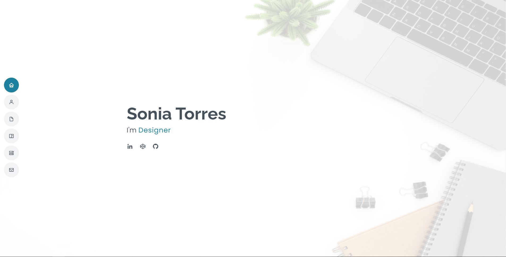

  <a href="https://soniatt93.github.io/">
    
    <h2 align="center">Sonia Torres</h2>
  </a>

 

Jr Full-Stack Developer

### Demo
For Demo of this template you can visit <a href="https://bootstrapmade.com/demo/MyResume/">bootstrapmade</a> 

### Highlights
1. Setup is very easy and you get a portfolio template of your own for free by bootstrapmade.
2. To add your details, you just need simple editing skills. No code changes required!
3. Simple and Fast website User Interface.
